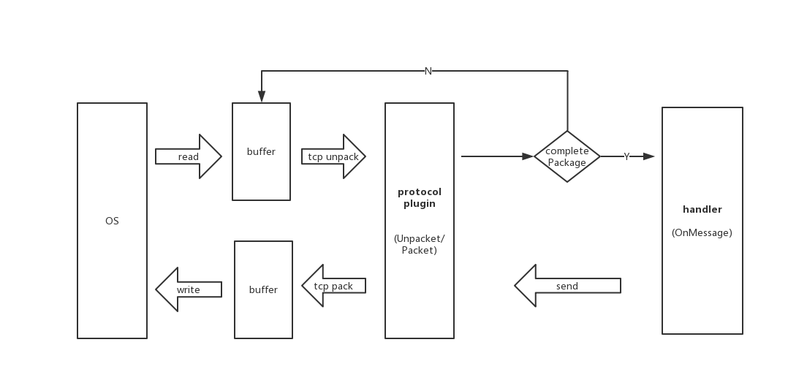

# tcp粘包与分包

tcp本身是一个面对流的协议,是一串没有界限的数据,所以本质上的说tcp的粘包是一个不存在的问题.对于tcp的数据来说在发送的会依据嵌套字的缓冲区的实际情况来进行包的划分和发送,一个完成的数据可能会被拆解进行多次发送,也可能将多个小数据合成一个较大的数据包一次发送.

所以一般粘包和分包都是值具体的业务规定的数据结构.对于一个tcp的框架处理情况



所以为了从tcp中获得传递来的数据,都会人为的规定数据构成,一般为 长度+数据 或者 使用固定的标志

定义 接口protocol
```
interface IProtocol interface{
    unpacket($conn);
    packet($data);
    getLen($raw);
}
```
对于不同的实现,只要实现对应的数据协议就能获得数据,从而进行后续处理.
下面我实现了一个简单的php实现的tcp服务器,并且使用了协议分包
固定的头长度+数据 4个字节的数据长度+数据
```
|数据长度n|payload|
|4字节|n字节|
```

```php
class Protocol implements IProtocol
{
    public function getLen($raw)
    {
        if (strlen($raw) < 4) {
            return 0;
        }
        return unpack('N', substr($raw, 0, 4))[1] + 4;
    }

    public function unpack($raw)
    {
        $data = [
            'len' => unpack('N', substr($raw, 0, 4))[1],
            'body' => substr($raw, 4)
        ];
        return $data;
    }

    public function pack($raw): string
    {
        return pack('N', $raw['len']) . $raw['body'];
    }

}
```

使用getLen获得对应的数据长度,整个数据包的长度 是头部的长度+4,这个4为头的长度

```php
class PServer
{
    protected $server;
    protected $conns = [];

    public function run()
    {
        $this->server = stream_socket_server("tcp://0.0.0.0:8000", $errno, $errstr);
        if (!$this->server) {
            exit('server up fail!');
        }
        echo 'listen' . PHP_EOL;
        $this->listen();
    }

    public function listen()
    {
        $reads = [$this->server];
        $writes = [];
        while (1) {
            $tmp_read = $reads;
            $tmp_write = $writes;
            $tmp_except = [];
            //如果没有就阻塞
            $r = stream_select($tmp_read, $tmp_write, $tmp_except, null);
            if ($r === false) {
                exit('失败!');
            }
            foreach ($tmp_read as $read) {
                if ($read === $this->server) {
                    $sock = stream_socket_accept($this->server, 5, $remote_address);
                    $fd_id = (int)$sock;
                    echo '有新的链接上来了' . $remote_address;
                    $reads[$fd_id] = $sock;
                    $this->conns[$fd_id] = new TcpConnection($sock);
                } else {
                    $fd_id = (int)$read;
                    $raw = $this->conns[$fd_id]->read();
                    if ($raw === false) {
                        unset($reads[$fd_id]);
                        continue;
                    } elseif ($raw === 0) {
                        continue;
                    }
                    ping($raw, $this->conns[$fd_id]);
                }
            }
            foreach ($tmp_except as $e) {
                echo 'error' . PHP_EOL;
            }
        }
    }
}
```

在每次连接都读取对应的,并且接受到数值后拆解包,获得头长度,读取数据,直到对应的长度.返回用户处理具体的拆包后的数据,比如显示后返回
