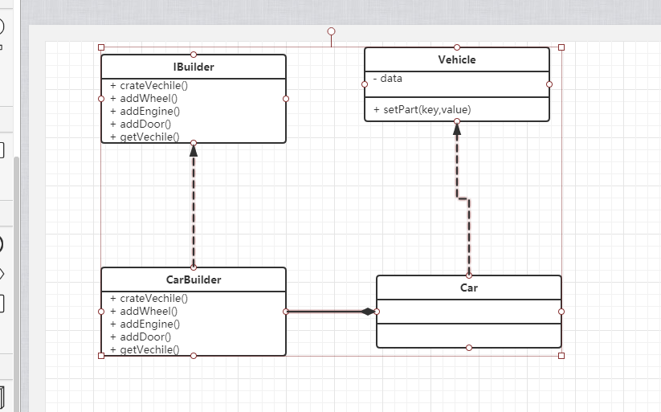

# 创建人(builder)

创建人是创建一个复杂对象的的一部分实现接口.用来简化复杂对象的创建.
如果对象有复杂的继承树,那么对于创建人来说,有一个对应的复杂程度的继承树也是符合逻辑的.因为对于一个复杂的对象有部分属性是可以使用默认值来替代每次的手动创建.

1. uml图

2. 代码

IBuidler.php
一个创建人的接口实现了vehicle的基础组成
```
<?php
interface IBuilder{
    public function createVehicle();

    public function addWheel();

    public function addEngine();

    public function addDoors();

    public function getVehicle(): Vehicle;
}
```

CarBuilder.php
```
<?php
class CarBuilder implements IBuilder{
    private $car;
     public function createVehicle(){
       $this->car=new Car();
     }

    public function addWheel(){
        $this->car->setPart('wheelLF', new Wheel());
        $this->car->setPart('wheelRF', new Wheel());
        $this->car->setPart('wheelLR', new Wheel());
        $this->car->setPart('wheelRR', new Wheel());
    }

    public function addEngine(){
        $this->car->setPart('engine', new Engine());
    }

    public function addDoors(){
        $this->car->setPart('rightDoor', new Door());
        $this->car->setPart('leftDoor', new Door());
    }

    public function getVehicle():Vehicle{
        return $this->car;
    } 
}
```
Vehicle.php
```
<?php
abstract class Vehicle
{
    /**
    * @var object[]
    */
    private $data = [];

    /**
    * @param string $key
    * @param object $value
    */
    public function setPart($key, $value)
    {
        $this->data[$key] = $value;
    }
}
```

Car.php
```
<?php
class Car extends Vehicle{

}
```


使用
```
<?php
$carBuilder=new CarBuilder();
$carBuilder->createVehicle();
$carBuilder->addWheel();
$carBuilder->addEngine();
$carBuilder->addDoors();

$car_a=$carBuilder->getVehicle();


```