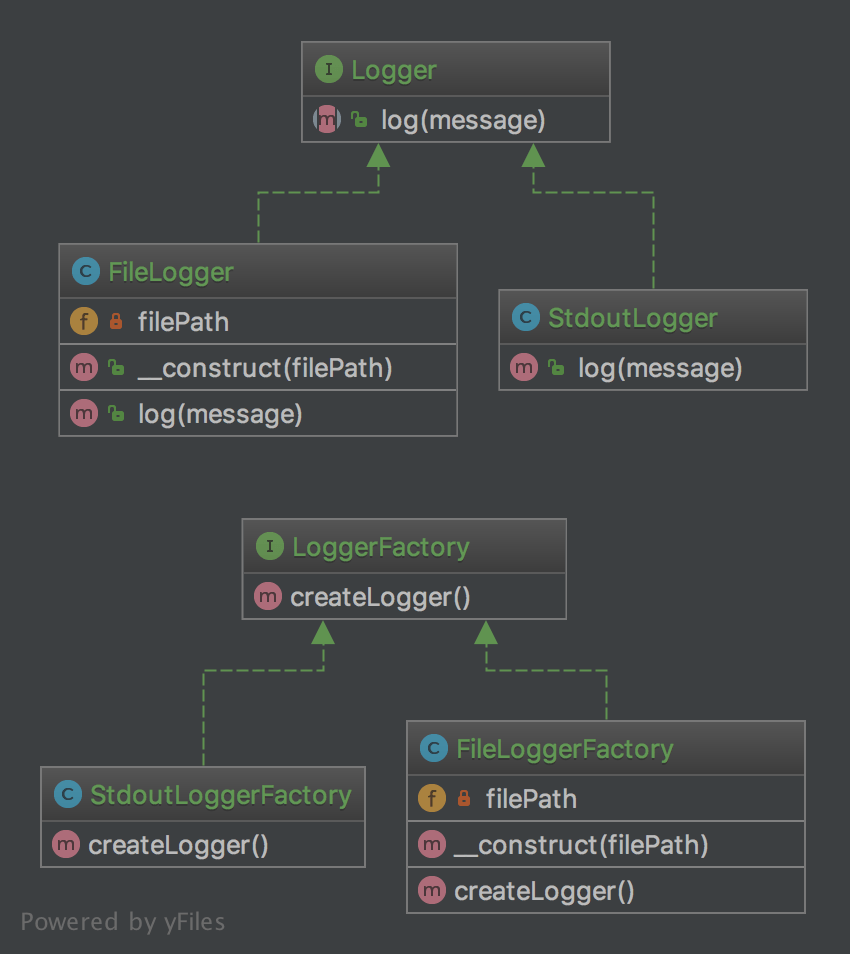

# 工厂模式

工厂模式解决了抽象类型如何创建对象实例的问题-->使用特定的类来处理,使用特定的子类来创建对象

1. uml图
   

从uml图中可以知道,使用了loggerfactory接口来获得不同的logger的实现类.这是因为不用的logger的具体实现不同,如果将其集中在一起,势必会导致if...else 的蔓延

2. 代码
   
ILogger.php
```
<?php
interface ILogger
{
    public function log(string $message);
}
```

StdoutLogger.php
```
<?php
class StdoutLogger implements ILogger
{
    public function log(string $message)
    {
        echo $message;
    }
}
```

FileLogger.php
```
<?php
class FileLogger implements Logger
{
    /**
     * @var string
     */
    private $filePath;
    public function __construct(string $filePath)
    {
        $this->filePath = $filePath;
    }
    public function log(string $message)
    {
        file_put_contents($this->filePath, $message . PHP_EOL, FILE_APPEND);
    }
}
```

ILoggerFactory.php
```
interface LoggerFactory
{
    public function createLogger(): Logger;
}
```
StdoutLoggerFactory.php
```
class StdoutLoggerFactory extends LoggerFactory{
    public function createLogger(): Logger{
        return new StdoutLogger();
    }
}
```

FileLoggerFactory.php
```
class FileLoggerFactory extends LoggerFactory{
    private $file;
    public function __construct(string $filePath)
    {
        $this->filePath = $filePath;
    }
    public function createLogger(): Logger
    {
        return new FileLogger($this->filePath);
    }
}
```


使用
```
function recordLog(ILogger logger,$string){
    logger->log($string);
}

$std=(new StdoutLoggerFactory())->createLogger();
recordLog($std,$string)

$std=(new FileLoggerFactory("/home/logger/"))->createLogger();
recordLog($std,$string)
```
可以看到,日志记录的方法依赖的是ILogger接口,在开始时,我可以传递的标准输出,将日志直接打印
在正式环境可以替换传递的实例,但是日志记录的代码不用修改


