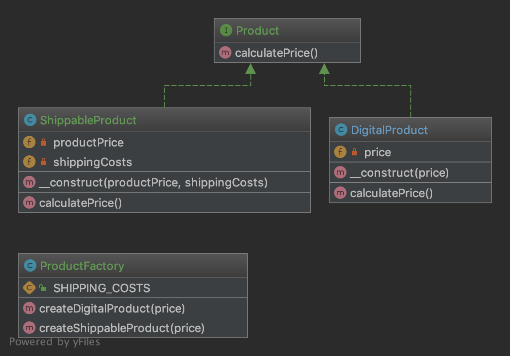

# 抽象工厂

## 目的 
在不指定具体类的情况下创建一系列相关或依赖对象。 通常创建的类都实现相同的接口。 抽象工厂的客户并不关心这些对象是如何创建的，它只是知道它们是如何一起运行的

集中生成实现了同一个但是相互之间灭有关系的对象实例

1.1 UML图

通过这个uml图,可以知道,现在有一个product接口,并且这个接口一个方法calculatePrice来计算价格

现在分别有一个shippableProduct,DigitalProduct实现的这个接口,还有一个productFacotory类来生成这2个类

```
interface Product{
    public function calculatePrice();
}

class shippableProduct implements Product(){
    private $productPrice;
    private $shippingCosts;
     public function __construct($productPrice, $shippingCosts)
    {
        $this->productPrice = $productPrice;
        $this->shippingCosts = $shippingCosts;
    }
    public function calculatePrice()
    {
        return $this->productPrice + $this->shippingCosts;
    }
}

class DigitalProduct implements Product(){
    private $productPrice;
     public function __construct($productPrice)
    {
        $this->productPrice = $productPrice;
    }
    public function calculatePrice()
    {
        return $this->productPrice;
    }
}

class ProductFactory(){
    public function createShippableProduct($price,$cost=50)
    {
        return new ShippableProduct($price,$cost);
    }
    public function createDigitalProduct($price)
    {
        return new DigitalProduct($price);
    }
}


factory=new ProductFactory();
echo factory->createShippableProduct(100,20)->calculatePrice();
echo "\n";
echo factory->createDigitalProduct(100)->calculatePrice();
```

使用工厂的好处:
+ 将创建其中,方便修改,同时尤其生成的对象实例,一定是实现了接口,那么调用者可以使用,而不需要关心其具体的实现
+ 可以添加或者移除任意的数组的具体实现,而不是影响其他功能
