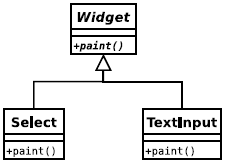
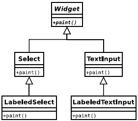
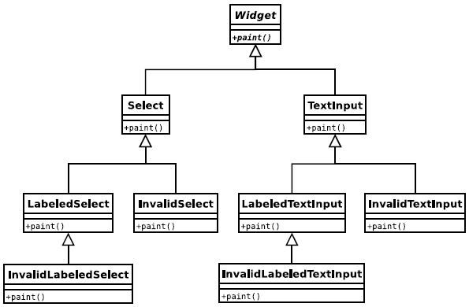

#装饰模式

  如果类缺少方法或者已有的方法需要修改,子类化并不总是可行或者恰当的.比如现在对象实例上改变或者微扩许多类的行为. 
  Decorator 对象持有一个对象的引用，并如实地重建被装饰对象的 public 接口。但 Decorator 也可以增加方法、扩展被装饰对象的接口或任意重载方法，甚至还可以在脚本执行期间有条件地重载。

## 解决方案
装饰器模式为子类化提供了一种领过的选择,允许动态的修改对象.增加功能,但是不会引起"子类爆炸".当用于一系列的子类时,装饰器尤其有用.
如果你有一系列子类(从相同的超类衍生而来)，而且需要增加另外的，可能独立于子类提供的功能，你就可以使用 Decorator 来避免代码复制和具体子类数目的增加。

这个观点用一些范例类图最容易理解。考虑一个基于“部件”概念的简单表单库，在库中，你想表示的每种表单控件都有一个与之对应的类。这样的类图可能看起来像：

Select 和 TextInput 都是 Widget 的子类。假设你想增加一个“labeled”部件，一个告诉你输入目的的输入表单。因为任何给定的表单控件都可能需要标示，你可以像下面这样子类化每个具体部件：

这个类图看起来还不算太坏，因此让我们再增加另一个功能。在表单验证的时候，如果一个表单控件无效，你希望能够指出来。再一次，应用到一个“无效”控件的代码也需要应用到所有的其它部件，因此又会产生大量的子类：
